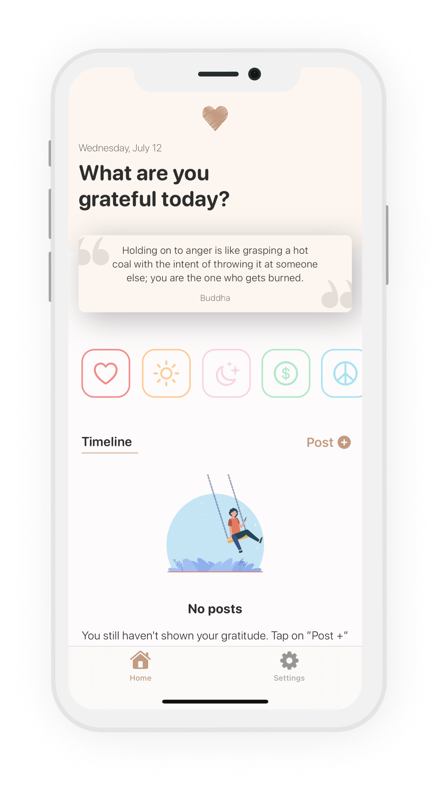
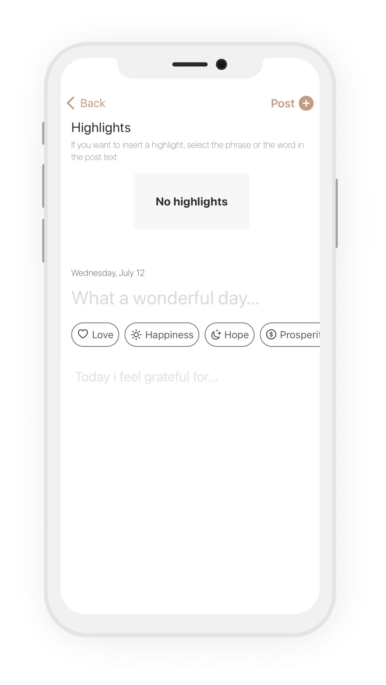
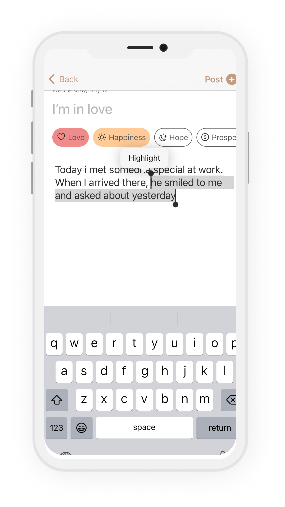

 
	
	
	
	

# Afeto - Gratitude Journal

**Current Stage:** <a href="https://apps.apple.com/app/id6451126734" target="_blank">Delivered</a> :rocket:

Afeto is a Gratitude Journal designed to be simple to use and be your daily place to express your emotions.

This app allows users to post about their feelings and share highlights of thoses posts at Instagram or using other social medias. 
All of that with Face ID/Touch ID protection to keep their posts private and Dark Mode option.

I did all the design at Figma ([Link for Dribbble](https://dribbble.com/shots/22294439-Grato-Gratitude-Journal-App)) and the code using `SwiftUI` + `Clean Architecture`.

Clean Architecture was used at this project for proper separation of responsabilities
The code is architecture with:
1. Use Cases for domain rules
2. Repositories and Datas for managing data flow
3. Views and View Models for managing view flow (MVVM)

The project has a few dependencies and all managed with `Swift Package Manager`:
1. `Firebase` for Storage, Remote Config, Messaging and Analytics
2. `Lottie` for using animations
3. `Networking` for abstracting network requests

All data is stored using `CoreData` and has a `CloudKit` integration to share data between Apple Devices.

All feedback is welcome and any suggestions can be sent to me by email or any social media 🥳

    <code>SwiftUI</code>&nbsp;&nbsp;
    <code>Clean Architecture</code>&nbsp;&nbsp;
    <code>Swift Package Manager</code>&nbsp;&nbsp;
    <code>CoreData with CloudKit</code>&nbsp;&nbsp;
    <code>Dark Mode</code>&nbsp;&nbsp;
    <code>Localization</code>&nbsp;&nbsp;
    <code>FaceID/TouchID</code>&nbsp;&nbsp;
    <code>Firebase</code>&nbsp;&nbsp;
    <code>Lottie</code>&nbsp;&nbsp;

    

  

    
    
    

# G Reader

**Current Stage:** Delivered for Interview :rocket:

GReader is an iOS articles Reader App made as a job application for a position at Globo (https://github.com/globoi).

The app has a favorites tab to list favorite articles. The app also have dark mode support and haptics feedback on the favorite button icon.

In this app, i built the app and logo design using Sketch and the iOS version was written in Xcode with Swift 5 using VIPER architecture.

	<code>Swift 5</code>&nbsp;&nbsp;
	<code>Alamofire</code>&nbsp;&nbsp;
	<code>CoreData</code>&nbsp;&nbsp;
	<code>Dark Mode</code>&nbsp;&nbsp;

	

  

	&nbsp;&nbsp;&nbsp;&nbsp;&nbsp;&nbsp;&nbsp;&nbsp;&nbsp;&nbsp;&nbsp;&nbsp;&nbsp;&nbsp;&nbsp;&nbsp;&nbsp;&nbsp;&nbsp;&nbsp;
	&nbsp;&nbsp;&nbsp;&nbsp;&nbsp;&nbsp;&nbsp;&nbsp;&nbsp;&nbsp;&nbsp;&nbsp;&nbsp;&nbsp;&nbsp;&nbsp;&nbsp;&nbsp;&nbsp;
	

# LB Vinhos 

**Current Stage:** <a href="https://apps.apple.com/us/app/lb-vinhos/id1433974673" target="_blank">Released</a> :rocket:

LB Vinhos is an Android/iOS wine ordering application through a closed list of previously registered customers. With this app its possible to choose through a large variety of wines from different regions of the world. The client can order a wine any time but every two months, approximately, the administrator open a round of exclusively wines where it offers exclusive promotions for a limited time. The app does not operates financial transactions, just take orders and manage them.

In the blog tab, its also possible to follow admin posts about degustation, vintages and other informations about the wine world. To reengagement, the app has 3 types of push notifications: order updates, new posts and new rounds.

In this app, i built the app and logo design using Sketch and the iOS version was written in Xcode with Swift 5. 

I shared with other developer the build of the API written in NodeJS with a MySQL database hosted at Heroku and the web dashboard was written with Angular 4.

	<code>Swift 5</code>&nbsp;&nbsp;
	<code>Firebase Auth</code>&nbsp;&nbsp;
	<code>Firebase Storage</code>&nbsp;&nbsp;
	<code>Firebase Messaging</code>&nbsp;&nbsp;
	<code>FacebookLogin</code>&nbsp;&nbsp;
	<code>GoogleSignIn</code>&nbsp;&nbsp;
	<code>Alamofire</code>&nbsp;&nbsp;
	<code>Kingfisher</code>&nbsp;&nbsp;
	<code>CoreData</code>&nbsp;&nbsp;
	<code>NodeJS</code>&nbsp;&nbsp;
	<code>MySQL</code>

	

  

	&nbsp;&nbsp;&nbsp;&nbsp;&nbsp;&nbsp;&nbsp;&nbsp;&nbsp;&nbsp;&nbsp;&nbsp;&nbsp;&nbsp;&nbsp;&nbsp;&nbsp;&nbsp;&nbsp;&nbsp;
	&nbsp;&nbsp;&nbsp;&nbsp;&nbsp;&nbsp;&nbsp;&nbsp;&nbsp;&nbsp;&nbsp;&nbsp;&nbsp;&nbsp;&nbsp;&nbsp;&nbsp;&nbsp;&nbsp;&nbsp;
	

