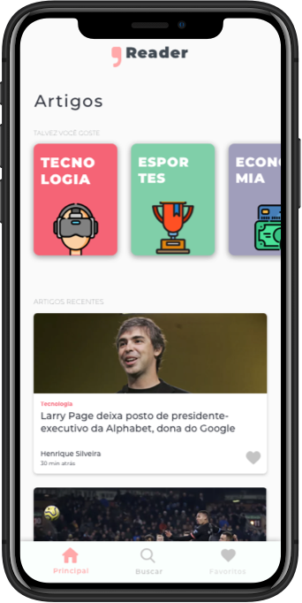
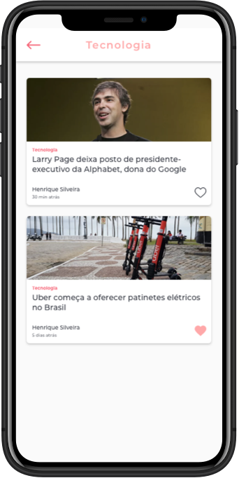
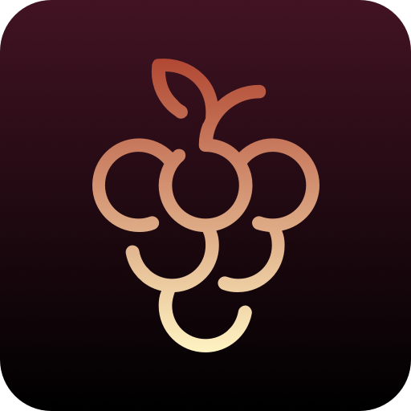
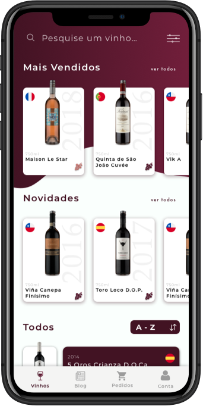
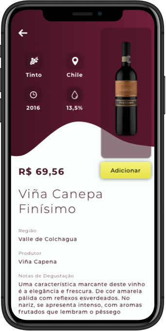
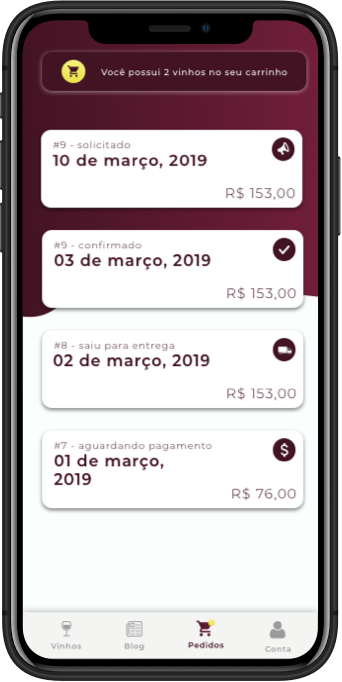
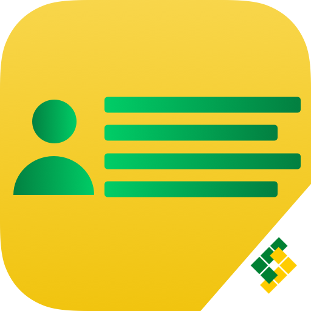
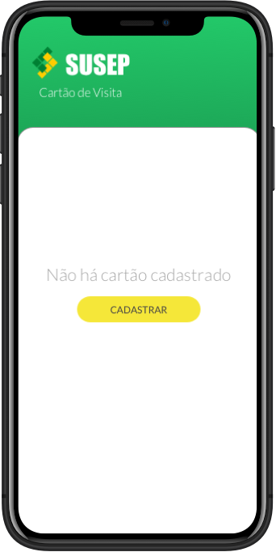
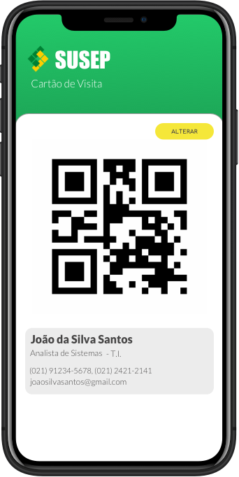
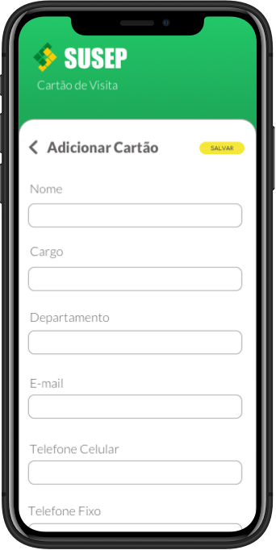

	 

<h1 align="center">Lohan Marques</h1>
<h3 align="center">Mobile Developer</h3>

 
	
	
	
	

# G Reader

**Current Stage:** Delivered :rocket:

GReader is an iOS articles reader app made for a job application at a major tech company.

The app has a favorites tab to list favorite articles. The app also have dark mode support and haptics feedback on the favorite button icon.

In this app, i built the app and logo design using Sketch and the iOS version was written in Xcode with Swift 5 using VIPER architecture.

	<code>Swift 5</code>&nbsp;&nbsp;
	<code>Alamofire</code>&nbsp;&nbsp;
	<code>CoreData</code>&nbsp;&nbsp;
	<code>Dark Mode</code>&nbsp;&nbsp;

	

  

	&nbsp;&nbsp;&nbsp;&nbsp;&nbsp;
	&nbsp;&nbsp;&nbsp;&nbsp;&nbsp;
	

# LB Vinhos 

**Current Stage:** <a href="https://apps.apple.com/us/app/lb-vinhos/id1433974673" target="_blank">Released</a> :rocket:

LB Vinhos is an Android/iOS wine ordering application through a closed list of previously registered customers. With this app its possible to choose through a large variety of wines from different regions of the world. The client can order a wine any time but every two months, approximately, the administrator open a round of exclusively wines where it offers exclusive promotions for a limited time. The app does not operates financial transactions, just take orders and manage them.

In the blog tab, its also possible to follow admin posts about degustation, vintages and other informations about the wine world. To reengagement, the app has 3 types of push notifications: order updates, new posts and new rounds.

In this app, i built the app and logo design using Sketch and the iOS version was written in Xcode with Swift 5. 

I shared with other developer the build of the API written in NodeJS with a MySQL database hosted at Heroku and the web dashboard was written with Angular 4.

	<code>Swift 5</code>&nbsp;&nbsp;
	<code>Firebase Auth</code>&nbsp;&nbsp;
	<code>Firebase Storage</code>&nbsp;&nbsp;
	<code>Firebase Messaging</code>&nbsp;&nbsp;
	<code>FacebookLogin</code>&nbsp;&nbsp;
	<code>GoogleSignIn</code>&nbsp;&nbsp;
	<code>Alamofire</code>&nbsp;&nbsp;
	<code>Kingfisher</code>&nbsp;&nbsp;
	<code>CoreData</code>&nbsp;&nbsp;
	<code>NodeJS</code>&nbsp;&nbsp;
	<code>MySQL</code>

	

  

	&nbsp;&nbsp;&nbsp;&nbsp;&nbsp;
	&nbsp;&nbsp;&nbsp;&nbsp;&nbsp;
	

# Cartão SUSEP

**Current Stage:** Released* :rocket:

> \* Released for internal distribution

Cartão SUSEP is an Android/iOS app to show a business card for a public administration organization.

In this app, i built the app and logo design using Sketch and the iOS version was written in Xcode with Swift 5.

	<code>Swift 5</code>&nbsp;&nbsp;
	<code>CoreImage</code>&nbsp;&nbsp;

	

  

	&nbsp;&nbsp;&nbsp;&nbsp;&nbsp;
	&nbsp;&nbsp;&nbsp;&nbsp;&nbsp;
	

